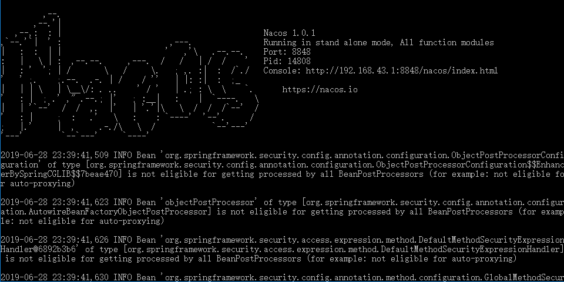
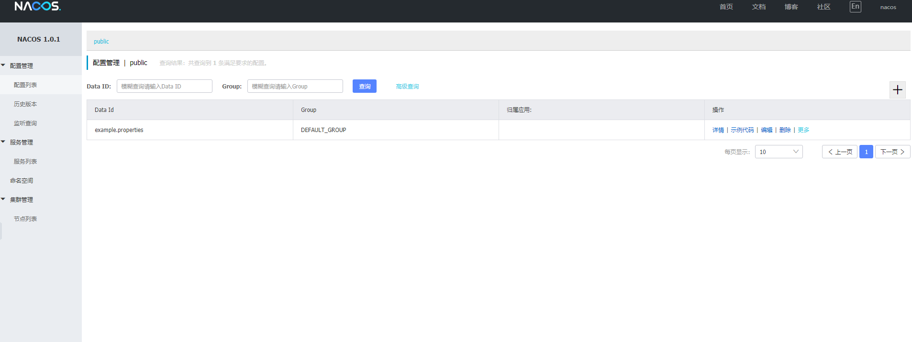
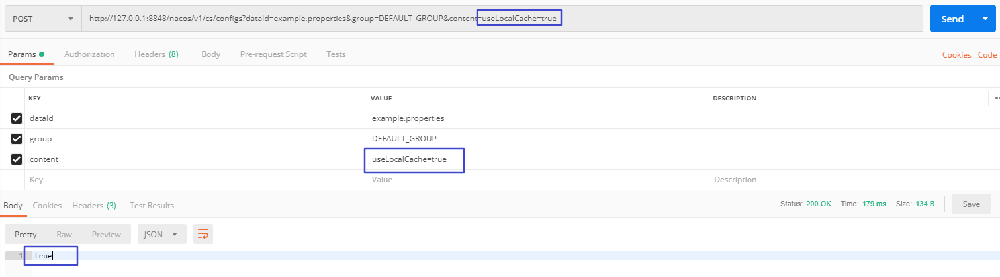
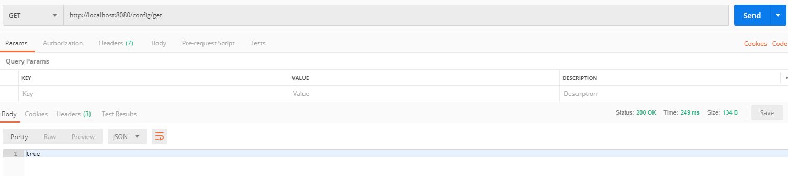
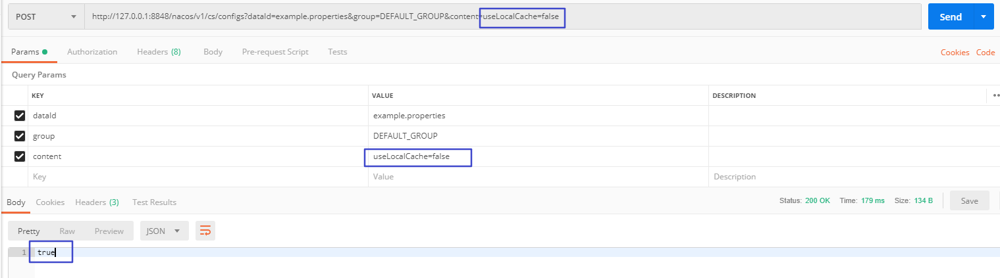
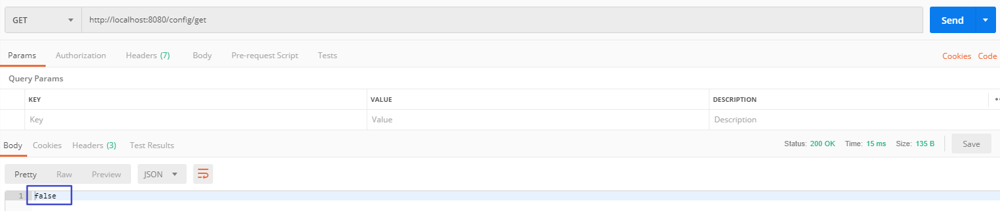
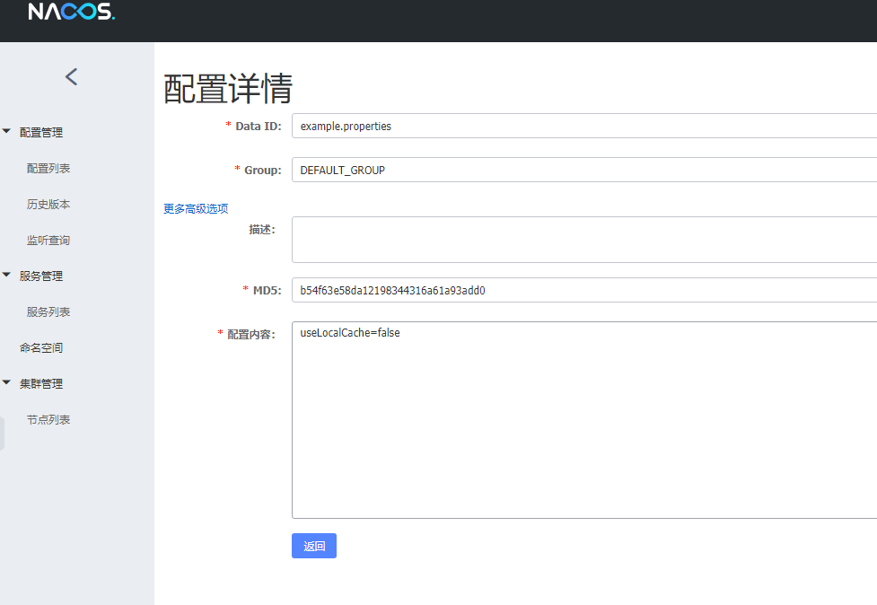
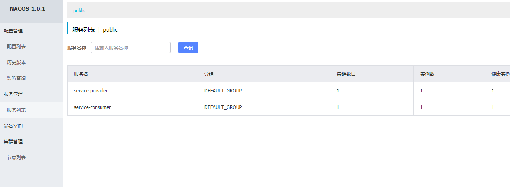
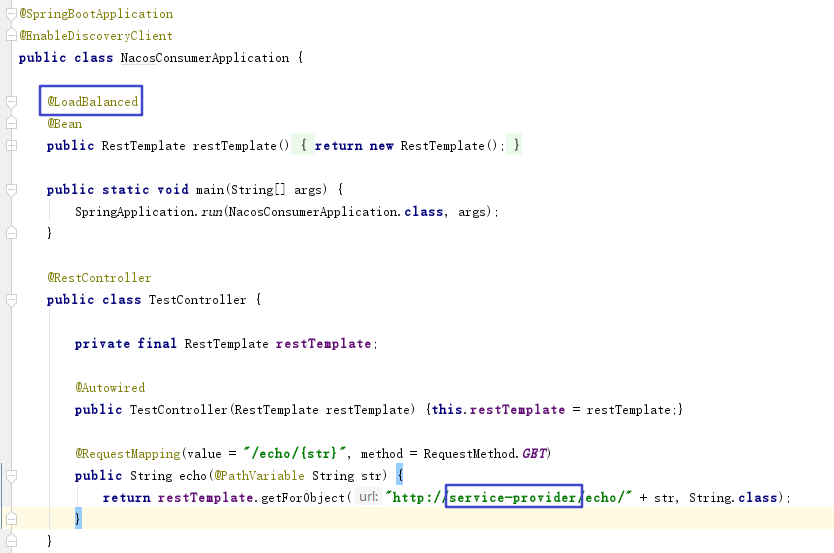

本文主要根据官方示例，初步了解Nacos，再思考一下，与Eureka的不同点和相同点。

### 下载

[Nacos Server下载地址](https://github.com/alibaba/nacos/releases)

[官方示例地址](https://github.com/nacos-group/nacos-examples)

### 启动Nacos Server

Windows环境：解压之后，`D:\nacos\bin`目录下，双击`startup.cmd`运行文件

**注意**：环境变量里面一定要配置MAVEN_HOME和JAVA_HOME，否则双击之后，一闪而过。

正常启动：

访问`http://localhost:8848/nacos/index.html`,即可看到如下界面：

### 发布配置

使用PostMan工具发送请求

### 验证配置是否发布成功

1. 启动nacos-spring-cloud-config-example
2. 获取配置：`http://localhost:8080/config/get`
3. 
4. 再次修改配置：`curl -X POST "http://127.0.0.1:8848/nacos/v1/cs/configs?dataId=example.properties&group=DEFAULT_GROUP&content=useLocalCache=false"`将useLocalCache的值修改为false
5. 
6. 再次获取配置：`http://localhost:8080/config/get`
7. 

返回false说明设置的值，动态生效了。

也可以直接去nacos的控制台查看：

### 服务注册与发现

1. 下载示例消费者和生成者代码

2. 示例代码已配置好注册中心的地址：`spring.cloud.nacos.discovery.server-addr=127.0.0.1:8848`

3. 启动消费者和生产者，可以在控制台看到已经注册到注册中心了。

4. 

5. 服务调用

6. 

   可以看到，通过`@LoadBalanced`注解，结合Ribbon实现负载均衡，通过生产者的服务名调用接口。

### 与Eureka对比

初次使用，总结肯定不够完善，后面慢慢的做更加详细的对比。

#### 相同点

1.  支持Ribbon结合`@LoadBalanced`注解，实现负载均衡
2. 都有一个控制台

#### 不同点

1. 官方的下载包可直接启动，不需要自己再创建项目启动。
2. Nacos的控制台，功能更加完善丰富，可直接动态配置，Eureka的控制台只能算是一个看板。
3. Nacos支持通过OPENAPI的方式，动态注册，这种有点类似ZK的注册方式